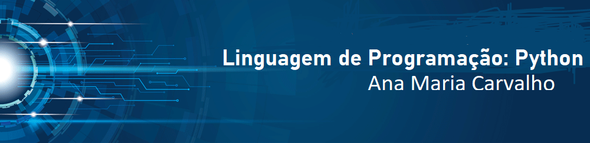

   

  

# Ana Maria Carvalho
*Linguagem de Programação Python*

**Links para conferir mais:**
* [LinkedIn](https://www.linkedin.com/in/carvalhoanamaria/)
* [Medium](https://medium.com/@anamariasous_)

## Artigos abordando assuntos relacionado ao Python:
 ### Na plataforma Colaboratory
* **Python - Manipulando Tuplas:** https://bit.ly/2VSKaeE
* **Python - Manipulando Dicionário:**

### Na plataforma Medium:
* **Python: Tipos de dados:** https://bit.ly/3c90SMg
* **Python - Manipulando Tuplas:** https://bit.ly/2VlApnX
* **Python - Manipulando Dicionário:** https://bit.ly/2VULuh6

